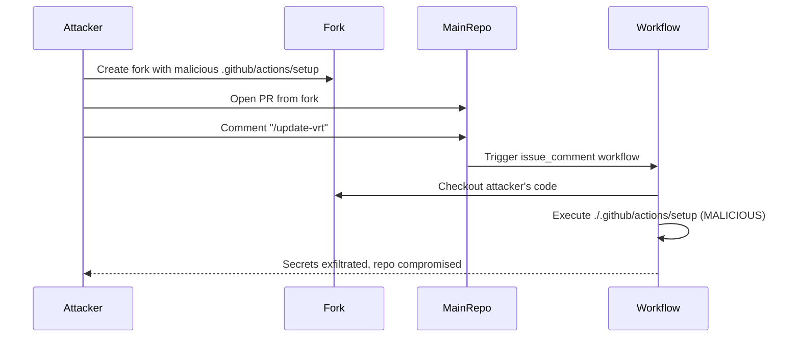

# GHSL-2024-325: Arbitrary Code Execution via Untrusted Fork Checkout

## Summary

| Item | Value |
|------|-------|
| Advisory ID | GHSL-2024-325 |
| Severity | Critical |
| Affected Component | Actual (visual regression testing tool) |
| CVE | N/A |
| CWE | CWE-94 (Improper Control of Generation of Code) |
| Reference | https://securitylab.github.com/advisories/GHSL-2024-325_GHSL-2024-326_Actual/ |

## Vulnerability Description

GHSL-2024-325 is an arbitrary code execution vulnerability that occurs when a GitHub Actions workflow:

1. Runs on a privileged trigger (`issue_comment`, `pull_request_target`, etc.)
2. Checks out code from an untrusted fork repository
3. Executes local actions (`./.github/actions/*`) from that untrusted code

This allows an attacker to execute arbitrary code with the workflow's elevated permissions by:
1. Creating a malicious fork with a backdoored local action
2. Submitting a pull request from that fork
3. Triggering the workflow via comment (e.g., `/update-vrt`)

## Attack Vector



## Vulnerable Code Pattern

```yaml
name: Update VRT (Vulnerable)

on:
  issue_comment:
    types: [created]

jobs:
  update-vrt:
    if: github.event.issue.pull_request && contains(github.event.comment.body, '/update-vrt')
    runs-on: ubuntu-latest
    permissions:
      contents: write
      pull-requests: write
    steps:
      - name: Get PR branch info
        id: comment-branch
        uses: actions/github-script@v7
        with:
          script: |
            const pr = await github.rest.pulls.get({...});
            core.setOutput('head_owner', pr.data.head.repo.owner.login);
            core.setOutput('head_repo', pr.data.head.repo.name);
            core.setOutput('head_ref', pr.data.head.ref);

      # VULNERABLE: Checkout from untrusted fork
      - name: Checkout PR code
        uses: actions/checkout@v4
        with:
          repository: ${{ steps.comment-branch.outputs.head_owner }}/${{ steps.comment-branch.outputs.head_repo }}
          ref: ${{ steps.comment-branch.outputs.head_ref }}

      # VULNERABLE: Execute local action from untrusted code
      - name: Set up environment
        uses: ./.github/actions/setup
```

## sisakulint Detection

sisakulint detects this vulnerability pattern with the following rules:

### 1. cache-poisoning-poisonable-step

```
script/actions/ghsl-2024-325-326.yaml:39:9: cache poisoning risk via local action:
'Set up environment' runs untrusted code after checking out PR head (triggers: issue_comment).
Attacker can steal cache tokens [cache-poisoning-poisonable-step]
```

This rule identifies when:
- A workflow uses privileged triggers (`issue_comment`, `pull_request_target`, `workflow_run`)
- Untrusted code is checked out (from fork or PR head)
- Local actions are executed after the checkout

### 2. Related Detection Rules

| Rule | Description |
|------|-------------|
| `dangerous-triggers-critical` | Identifies privileged triggers without security mitigations |
| `commit-sha` | Warns about unpinned action versions |
| `artipacked` | Detects credential persistence in checkout |

## Remediation

### Option 1: Checkout from base repository only

```yaml
- uses: actions/checkout@v4
  with:
    ref: ${{ github.event.pull_request.base.ref }}
```

### Option 2: Use workflow_call with restricted permissions

```yaml
# In main workflow
jobs:
  build:
    uses: ./.github/workflows/safe-build.yml
    with:
      pr-number: ${{ github.event.issue.number }}
```

### Option 3: Avoid local action execution from untrusted code

```yaml
# Use pinned external actions instead of local actions
- uses: owner/setup-action@v1.0.0
```

## Test Files

- Vulnerable pattern: `script/actions/ghsl/ghsl-2024-325-326.yaml`

## References

- [GitHub Security Lab Advisory](https://securitylab.github.com/advisories/GHSL-2024-325_GHSL-2024-326_Actual/)
- [OWASP CI/CD Security: Poisoned Pipeline Execution](https://owasp.org/www-project-top-10-ci-cd-security-risks/CICD-SEC-04-Poisoned-Pipeline-Execution)
- [Keeping your GitHub Actions and workflows secure Part 1](https://securitylab.github.com/resources/github-actions-preventing-pwn-requests/)
