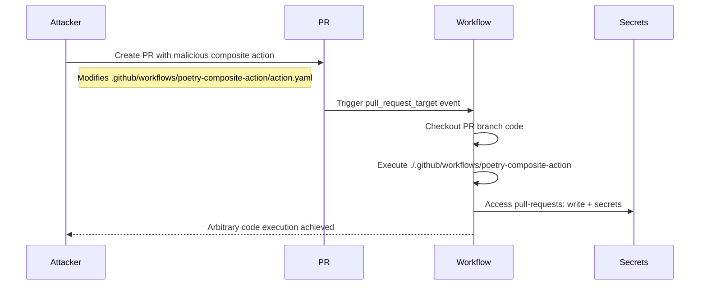

# GHSL-2025-006: Untrusted Code Execution via Composite Action

## Summary

| Item | Value |
|------|-------|
| Advisory ID | GHSL-2025-006 |
| Severity | Critical |
| Affected Component | bramstroker/homeassistant-powercalc |
| CVE | N/A |
| CWE | CWE-94 (Improper Control of Generation of Code) |
| Reference | https://securitylab.github.com/advisories/GHSL-2025-006_homeassistant-powercalc/ |

## Vulnerability Description

GHSL-2025-006 is an untrusted code execution vulnerability in the `validate-lut-files.yml` workflow. The vulnerability occurs when:

1. A workflow uses `pull_request_target` trigger (privileged context)
2. Checks out code from the PR branch (attacker-controlled)
3. Executes a composite action from the checked-out code

This allows an attacker to execute arbitrary code by modifying the composite action in their PR.

## Attack Vector



## Vulnerable Code Pattern

```yaml
name: Validate LUT Files (Vulnerable)

on:
  pull_request_target:
    types: [opened, synchronize]

permissions:
  pull-requests: write

jobs:
  validate:
    runs-on: ubuntu-latest
    steps:
      # VULNERABLE: Checks out PR branch code (attacker-controlled)
      - uses: actions/checkout@v4
        with:
          ref: ${{ github.event.pull_request.head.sha }}

      # VULNERABLE: Executes composite action from PR branch
      # Attacker can modify .github/workflows/poetry-composite-action/action.yaml
      - uses: ./.github/workflows/poetry-composite-action

      - name: Validate files
        run: |
          python validate.py
```

## sisakulint Detection

sisakulint detects this vulnerability with the following rules:

### 1. untrusted-checkout

```
[untrusted-checkout] checking out untrusted code from pull request in workflow
with privileged trigger 'pull_request_target'. This allows potentially malicious
code from external contributors to execute with access to repository secrets.
```

### 2. cache-poisoning-poisonable-step

```
[cache-poisoning-poisonable-step] cache poisoning risk via local action:
'./.github/workflows/poetry-composite-action' runs untrusted code after
checking out PR head (triggers: pull_request_target). Attacker can steal cache tokens
```

## Remediation

### Option 1: Use pull_request trigger instead

```yaml
on:
  pull_request:
    types: [opened, synchronize]
```

### Option 2: Checkout base branch only

```yaml
- uses: actions/checkout@v4
  # Without ref, checks out base branch (safe)
```

### Option 3: Use external pinned actions

```yaml
# Instead of local composite action
- uses: external/poetry-setup@v1.0.0
```

## Auto-Fix Support

sisakulint provides auto-fix for the untrusted checkout:

```bash
sisakulint -fix on script/actions/ghsl/ghsl-2025-006.yaml
```

## Test Files

- Vulnerable pattern: `script/actions/ghsl/ghsl-2025-006.yaml`

## References

- [GitHub Security Lab Advisory](https://securitylab.github.com/advisories/GHSL-2025-006_homeassistant-powercalc/)
- [Keeping your GitHub Actions and workflows secure](https://securitylab.github.com/resources/github-actions-preventing-pwn-requests/)
