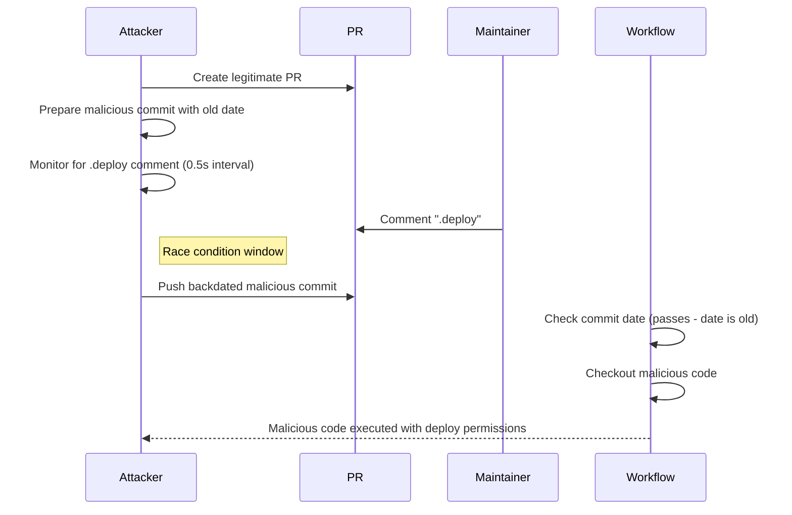

# GHSL-2025-038: TOCTOU Approval Bypass in branch-deploy

## Summary

| Item | Value |
|------|-------|
| Advisory ID | GHSL-2025-038 |
| Severity | High |
| Affected Component | github/branch-deploy |
| CVE | N/A |
| CWE | CWE-367 (Time-of-check Time-of-use Race Condition) |
| Reference | https://securitylab.github.com/advisories/GHSL-2025-038_github_branch-deploy_action/ |

## Vulnerability Description

GHSL-2025-038 is a Time-of-check Time-of-use (TOCTOU) vulnerability in the github/branch-deploy action. The vulnerability allows an attacker to bypass deployment approval by exploiting a race condition between the time a maintainer approves a deployment and the time the code is checked out.

The vulnerability exists because:
1. The action uses commit date to verify code hasn't changed after approval
2. Commit dates can be manipulated by attackers (backdated commits)
3. An attacker can push malicious code immediately after approval is detected

## Attack Vector



## Vulnerable Code Pattern

```yaml
name: Branch Deploy (Vulnerable TOCTOU)

on:
  issue_comment:
    types: [created]

permissions:
  contents: write
  pull-requests: write
  deployments: write

jobs:
  deploy:
    if: github.event.issue.pull_request && contains(github.event.comment.body, '.deploy')
    runs-on: ubuntu-latest
    steps:
      - uses: github/branch-deploy@v9
        id: branch-deploy

      # VULNERABLE: TOCTOU - commit SHA can change between approval and checkout
      - uses: actions/checkout@v4
        with:
          ref: ${{ steps.branch-deploy.outputs.sha }}

      - name: Deploy
        run: |
          ./deploy.sh
        env:
          DEPLOY_TOKEN: ${{ secrets.DEPLOY_TOKEN }}
```

## sisakulint Detection

sisakulint detects the dangerous pattern with the following rule:

### cache-poisoning-poisonable-step

```
[cache-poisoning-poisonable-step] cache poisoning risk via local script execution:
'Deploy' runs untrusted code after checking out PR head (triggers: issue_comment).
Attacker can steal cache tokens
```

**Note**: sisakulint detects the general dangerous pattern but does not have specific TOCTOU detection. The detection identifies that code is executed after checking out potentially untrusted code in a privileged context.

## Remediation

### Option 1: Upgrade to branch-deploy v10.4.0+

```yaml
- uses: github/branch-deploy@v10.4.0
  with:
    deployment_confirmation: true  # New feature to prevent TOCTOU
```

### Option 2: Require branch protection with approvals

Configure branch protection rules to require PR approval before merge, preventing force pushes.

### Option 3: Use deployment environments

```yaml
jobs:
  deploy:
    environment: production  # Requires manual approval
```

## Attack Prerequisites

For this attack to succeed:
- `allow_forks` must be `true` (default setting)
- Branch protection rules must not require PR approval
- Attacker must be able to monitor comments in real-time

## Test Files

- Vulnerable pattern: `script/actions/ghsl/ghsl-2025-038.yaml`

## References

- [GitHub Security Lab Advisory](https://securitylab.github.com/advisories/GHSL-2025-038_github_branch-deploy_action/)
- [branch-deploy v10.4.0 Release Notes](https://github.com/github/branch-deploy/releases/tag/v10.4.0)
- [CWE-367: Time-of-check Time-of-use (TOCTOU) Race Condition](https://cwe.mitre.org/data/definitions/367.html)
