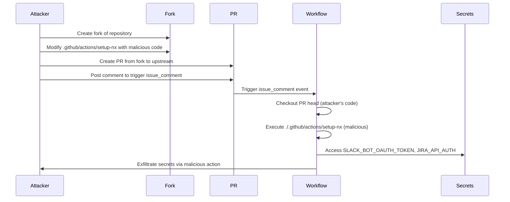

# GHSL-2025-082: Cache Poisoning via Local Action Execution

## Summary

| Item | Value |
|------|-------|
| Advisory ID | GHSL-2025-082 |
| Severity | Critical |
| Affected Component | ag-grid/ag-grid |
| CVE | N/A |
| CWE | CWE-829 (Inclusion of Functionality from Untrusted Control Sphere) |
| Reference | https://securitylab.github.com/advisories/GHSL-2025-082_ag-grid_ag-grid/ |

## Vulnerability Description

GHSL-2025-082 is a code execution vulnerability in GitHub Actions workflows that occurs when:

1. A workflow is triggered by a privileged event (`issue_comment`, `pull_request_target`, `workflow_run`)
2. The workflow checks out untrusted PR code using `ref: ${{ github.event.pull_request.head.sha }}`
3. After checkout, the workflow executes a local action (e.g., `./.github/actions/setup-nx`)

This pattern allows attackers to execute arbitrary code with access to repository secrets by modifying the local action in their fork.

## Attack Vector



## Vulnerable Code Pattern

```yaml
name: Performance Workflow

on:
  issue_comment:
    types: [created]

permissions:
  pull-requests: write
  issues: write

jobs:
  performance:
    runs-on: ubuntu-latest
    steps:
      # VULNERABLE: Checkout PR head code (untrusted)
      - uses: actions/checkout@v4
        with:
          ref: ${{ github.event.pull_request.head.sha }}

      # VULNERABLE: Execute local action from checked out code
      # This action is now controlled by the attacker!
      - name: Setup
        uses: ./.github/actions/setup-nx

      # Secrets are now compromised
      - name: Post to Slack
        uses: slackapi/slack-github-action@v1
        env:
          SLACK_BOT_TOKEN: ${{ secrets.SLACK_BOT_OAUTH_TOKEN }}
```

### Why This Is Dangerous

1. **Untrusted Checkout**: `ref: ${{ github.event.pull_request.head.sha }}` checks out the PR author's code
2. **Local Action Execution**: `./.github/actions/setup-nx` is read from the checked-out code
3. **Attacker Control**: The attacker can replace the local action with arbitrary malicious code
4. **Secret Access**: The malicious action runs with access to all workflow secrets

## sisakulint Detection

sisakulint detects this vulnerability with the `cache-poisoning-poisonable-step` rule:

### Detection Output

```
script/actions/ghsl/ghsl-2025-082.yaml:36:9: cache poisoning risk via local action:
'./.github/actions/setup-nx' runs untrusted code after checking out PR head
(triggers: issue_comment). Attacker can steal cache tokens [cache-poisoning-poisonable-step]

script/actions/ghsl/ghsl-2025-082.yaml:54:9: cache poisoning risk via local script
execution: 'run: ./scripts/setup.sh' runs untrusted code after checking out PR head
(triggers: issue_comment). Attacker can steal cache tokens [cache-poisoning-poisonable-step]

script/actions/ghsl/ghsl-2025-082.yaml:65:9: cache poisoning risk via build command:
'run: npm install' runs untrusted code after checking out PR head
(triggers: issue_comment). Attacker can steal cache tokens [cache-poisoning-poisonable-step]
```

### Detection Conditions

The rule triggers when ALL of the following conditions are met:

| Condition | Description |
|-----------|-------------|
| Unsafe Trigger | `issue_comment`, `pull_request_target`, or `workflow_run` |
| Unsafe Checkout | `ref` contains `github.event.pull_request.head.sha/ref` |
| Poisonable Step | Local action (`./`), local script, or build command after checkout |

### Poisonable Step Types

| Type | Pattern | Example |
|------|---------|---------|
| Local Action | `uses: ./...` | `./.github/actions/setup-nx` |
| Local Script | `./script.sh` | `./scripts/setup.sh` |
| Build Command | `npm install`, `make`, etc. | `npm install`, `pip install` |
| GitHub Script Import | `require('./local')` | `require('./lib/helper')` |

## Remediation

### Option 1: Remove Unsafe Ref (Recommended)

```yaml
- uses: actions/checkout@v4
  # Don't specify ref - defaults to safe base branch

- name: Setup
  uses: ./.github/actions/setup-nx
```

### Option 2: Use Safe Ref

```yaml
- uses: actions/checkout@v4
  with:
    ref: ${{ github.sha }}  # Base branch SHA, not PR head

- name: Setup
  uses: ./.github/actions/setup-nx
```

### Option 3: Split Privileged and Unprivileged Work

```yaml
# Workflow 1: Run performance tests (unprivileged)
name: Performance Tests
on: pull_request

jobs:
  test:
    runs-on: ubuntu-latest
    steps:
      - uses: actions/checkout@v4
      - run: npm run perf-test
      - uses: actions/upload-artifact@v4
        with:
          name: results
          path: results.json

---

# Workflow 2: Post results (privileged)
name: Post Results
on:
  workflow_run:
    workflows: ["Performance Tests"]
    types: [completed]

jobs:
  post:
    runs-on: ubuntu-latest
    steps:
      - uses: actions/download-artifact@v4
      # Process results safely (no untrusted code execution)
```

### Option 4: Require Approval for External Contributors

Configure repository settings to require approval before running workflows from first-time contributors.

### Option 5: Restrict to Collaborators

```yaml
jobs:
  performance:
    if: |
      github.event.comment.author_association == 'OWNER' ||
      github.event.comment.author_association == 'MEMBER' ||
      github.event.comment.author_association == 'COLLABORATOR'
```

## Additional Security Considerations

### Never Execute Untrusted Code with Secrets

After checking out untrusted code, any of the following can execute attacker-controlled code:

- Local actions (`./.github/actions/*`)
- Local scripts (`./scripts/*.sh`)
- Build tools (`npm install`, `pip install`, `make`, etc.)
- Interpreters running local files (`node ./script.js`, `python ./script.py`)

### Minimize Secret Exposure

Only pass secrets to steps that absolutely need them:

```yaml
# BAD: Secret available to all steps
env:
  SLACK_TOKEN: ${{ secrets.SLACK_TOKEN }}

# GOOD: Secret only available to specific step
- name: Post to Slack
  env:
    SLACK_TOKEN: ${{ secrets.SLACK_TOKEN }}
  run: ...
```

### Use workflow_run Pattern for Safe PR Workflows

The `workflow_run` pattern separates untrusted code execution from privileged operations:

1. First workflow: Triggered by `pull_request`, runs untrusted code
2. Second workflow: Triggered by `workflow_run`, has secrets but doesn't run untrusted code

## Auto-Fix Support

sisakulint provides auto-fix for this vulnerability:

```bash
# Preview the fix
sisakulint -fix dry-run script/actions/ghsl/ghsl-2025-082.yaml

# Apply the fix
sisakulint -fix on script/actions/ghsl/ghsl-2025-082.yaml
```

The auto-fix will:
1. Remove the unsafe `ref` parameter from the checkout step
2. This prevents checking out untrusted PR code

## Test Files

- Vulnerable pattern: `script/actions/ghsl/ghsl-2025-082.yaml`

## References

- [GitHub Security Lab Advisory](https://securitylab.github.com/advisories/GHSL-2025-082_ag-grid_ag-grid/)
- [GitHub Actions: Preventing pwn requests](https://securitylab.github.com/resources/github-actions-preventing-pwn-requests/)
- [GitHub Actions: Security hardening](https://docs.github.com/en/actions/security-guides/security-hardening-for-github-actions)
- [OWASP CI/CD Top 10: CICD-SEC-4](https://owasp.org/www-project-top-10-ci-cd-security-risks/CICD-SEC-04-Poisoned-Pipeline-Execution)
