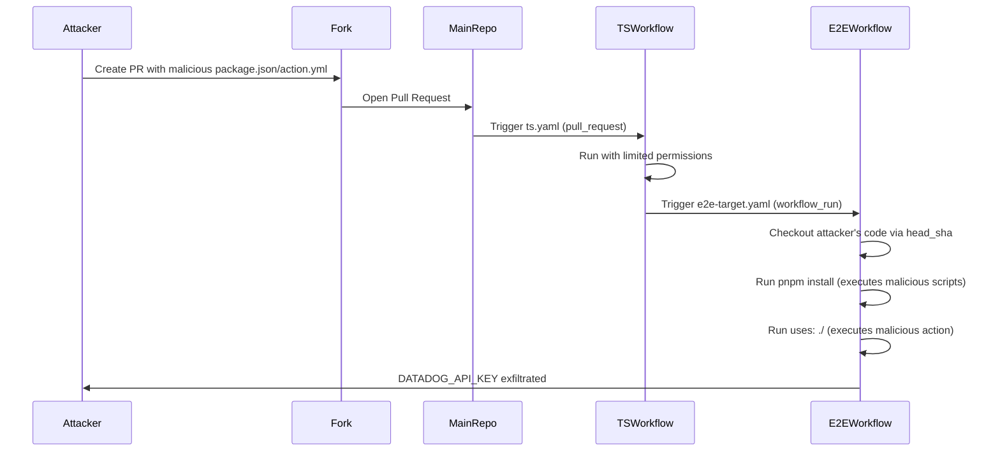

# GHSL-2025-084: Untrusted Code Execution via workflow_run Checkout

## Summary

| Item | Value |
|------|-------|
| Advisory ID | GHSL-2025-084 |
| Severity | Critical |
| Affected Component | int128/datadog-actions-metrics |
| CVE | N/A |
| CWE | CWE-94 (Improper Control of Generation of Code) |
| Reference | https://securitylab.github.com/advisories/GHSL-2025-084_int128_datadog-actions-metrics/ |

## Vulnerability Description

GHSL-2025-084 is a code execution vulnerability in GitHub Actions workflows that use the `workflow_run` trigger to checkout and execute untrusted code. The vulnerability occurs when:

1. A `workflow_run` workflow checks out code using `github.event.workflow_run.head_sha`
2. The checked-out code is then executed via package manager commands (`pnpm install`, `npm install`, etc.)
3. A local action (`uses: ./`) is executed from the checked-out repository

The `workflow_run` trigger is particularly dangerous because:
1. It runs with elevated privileges (write access to the repository, access to secrets)
2. It can be triggered by workflows running on pull requests from forks
3. The `head_sha` points to attacker-controlled code from the triggering workflow

## Attack Vector



## Vulnerable Code Pattern

```yaml
name: Vulnerable E2E Workflow

on:
  workflow_run:
    workflows: [ts]
    types:
      - completed

jobs:
  e2e:
    runs-on: ubuntu-latest
    steps:
      # VULNERABLE: Checking out untrusted PR code
      - uses: actions/checkout@v4
        with:
          ref: ${{ github.event.workflow_run.head_sha }}

      - uses: actions/setup-node@v4
        with:
          node-version: 20

      - run: corepack enable pnpm

      # VULNERABLE: pnpm install executes scripts from attacker's package.json
      - run: pnpm i

      # VULNERABLE: pnpm build executes attacker's build scripts
      - run: pnpm build

      # VULNERABLE: Local action from untrusted checkout
      - uses: ./
        with:
          datadog-api-key: ${{ secrets.DATADOG_API_KEY }}
```

### Attack Vectors

1. **Malicious package.json scripts**: An attacker can add `preinstall`, `postinstall`, or `prepare` scripts that execute arbitrary code when `pnpm install` runs.

2. **Malicious action.yml**: The local action (`uses: ./`) executes `action.yml` from the checked-out code, which can run arbitrary code.

3. **Malicious build scripts**: `pnpm build` executes whatever is defined in the `build` script of `package.json`.

## sisakulint Detection

sisakulint detects this vulnerability with the `cache-poisoning-poisonable-step` rule:

### Detection Output

```
script/actions/ghsl/ghsl-2025-084.yaml:13:3: dangerous trigger (critical): workflow uses
privileged trigger(s) [workflow_run] without any security mitigations. These triggers
grant write access and secrets access to potentially untrusted code.
[dangerous-triggers-critical]

script/actions/ghsl/ghsl-2025-084.yaml:38:9: cache poisoning risk via build command:
'run: pnpm build' runs untrusted code after checking out PR head (triggers: workflow_run).
Attacker can steal cache tokens [cache-poisoning-poisonable-step]

script/actions/ghsl/ghsl-2025-084.yaml:41:9: cache poisoning risk via local action:
'./' runs untrusted code after checking out PR head (triggers: workflow_run).
Attacker can steal cache tokens [cache-poisoning-poisonable-step]
```

### Detected Patterns

| Pattern | Risk | Description |
|---------|------|-------------|
| `ref: ${{ github.event.workflow_run.head_sha }}` | Critical | Checkout of untrusted PR code |
| `pnpm install/i` | Critical | Package manager can execute malicious scripts |
| `npm install/ci` | Critical | Package manager can execute malicious scripts |
| `yarn` | Critical | Package manager can execute malicious scripts |
| `uses: ./` | Critical | Local action execution from untrusted code |
| `./script.sh` | Critical | Local script execution from untrusted code |

## Why workflow_run + Checkout is Dangerous

The combination of `workflow_run` trigger and untrusted checkout creates a privilege escalation path:

1. **Initial Trigger**: A `pull_request` workflow runs with read-only permissions on fork PRs
2. **Escalation**: The `workflow_run` trigger fires with full repository permissions and secrets
3. **Code Execution**: Checking out the PR head and running build commands executes attacker-controlled code in a privileged context

This attack pattern allows:
- Theft of repository secrets (API keys, tokens)
- Arbitrary code execution with write permissions
- Supply chain attacks via compromised releases
- Lateral movement using stolen credentials

## Remediation

### Option 1: Avoid Checkout of PR Code in workflow_run

```yaml
on:
  workflow_run:
    workflows: [ts]
    types:
      - completed

jobs:
  e2e:
    runs-on: ubuntu-latest
    steps:
      # SAFE: Checkout default branch instead of PR code
      - uses: actions/checkout@v4
        # No ref specified = checkout default branch

      # Download artifacts from the triggering workflow instead
      - uses: actions/download-artifact@v4
        with:
          name: build-output
          github-token: ${{ secrets.GITHUB_TOKEN }}
          run-id: ${{ github.event.workflow_run.id }}
```

### Option 2: Restrict to Same Repository Only

```yaml
jobs:
  e2e:
    # Only run for the main repository, not forks
    if: github.event.workflow_run.head_repository.full_name == github.repository
    runs-on: ubuntu-latest
    steps:
      - uses: actions/checkout@v4
        with:
          ref: ${{ github.event.workflow_run.head_sha }}
```

### Option 3: Use Immutable Build Artifacts

```yaml
# In the triggering workflow (ts.yaml)
jobs:
  build:
    runs-on: ubuntu-latest
    steps:
      - uses: actions/checkout@v4
      - run: pnpm install && pnpm build
      - uses: actions/upload-artifact@v4
        with:
          name: build-output
          path: dist/

# In workflow_run workflow
jobs:
  e2e:
    runs-on: ubuntu-latest
    steps:
      # SAFE: Only use pre-built artifacts, don't execute untrusted code
      - uses: actions/download-artifact@v4
        with:
          name: build-output
          run-id: ${{ github.event.workflow_run.id }}
      # Run tests against built artifacts only
```

### Option 4: Separate Privileged and Unprivileged Operations

```yaml
# Unprivileged workflow (runs on PR)
name: Build
on: [pull_request]
jobs:
  build:
    runs-on: ubuntu-latest
    steps:
      - uses: actions/checkout@v4
      - run: pnpm install && pnpm build && pnpm test
      - uses: actions/upload-artifact@v4
        with:
          name: test-results
          path: test-results/

# Privileged workflow (workflow_run)
name: Report
on:
  workflow_run:
    workflows: [Build]
    types: [completed]
jobs:
  report:
    runs-on: ubuntu-latest
    steps:
      # SAFE: Only download and process artifacts, no code execution
      - uses: actions/download-artifact@v4
        with:
          name: test-results
          run-id: ${{ github.event.workflow_run.id }}
      # Process results without executing untrusted code
      - run: cat test-results/summary.json
```

## Additional Security Considerations

### Never Execute Untrusted Code with Secrets

If your workflow has access to secrets, never:
- Checkout PR code and run build commands
- Execute local actions from PR code
- Run scripts from PR code

### Use Read-Only Permissions Where Possible

```yaml
permissions:
  contents: read
  # Only add write permissions if absolutely necessary
```

### Validate Workflow Run Source

```yaml
jobs:
  e2e:
    if: |
      github.event.workflow_run.conclusion == 'success' &&
      github.event.workflow_run.head_repository.full_name == github.repository
```

## Auto-Fix Support

sisakulint provides auto-fix for this vulnerability:

```bash
# Preview the fix
sisakulint -fix dry-run script/actions/ghsl/ghsl-2025-084.yaml

# Apply the fix
sisakulint -fix on script/actions/ghsl/ghsl-2025-084.yaml
```

The auto-fix will remove the `ref` parameter from the checkout step, causing it to checkout the default branch instead of the untrusted PR code.

## Test Files

- Vulnerable pattern: `script/actions/ghsl/ghsl-2025-084.yaml`

## References

- [GitHub Security Lab Advisory](https://securitylab.github.com/advisories/GHSL-2025-084_int128_datadog-actions-metrics/)
- [GitHub Actions: workflow_run event](https://docs.github.com/en/actions/using-workflows/events-that-trigger-workflows#workflow_run)
- [Keeping your GitHub Actions and workflows secure Part 3](https://securitylab.github.com/resources/github-actions-building-blocks/)
- [OWASP CI/CD Security Risks](https://owasp.org/www-project-top-10-ci-cd-security-risks/)
