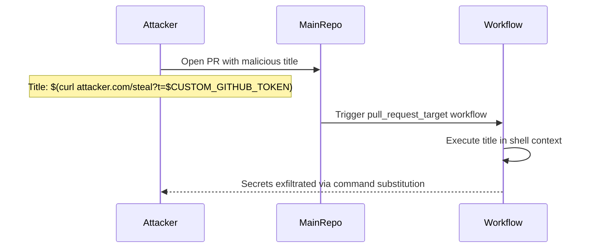

# GHSL-2025-090: Code Injection via PR Title in pull_request_target

## Summary

| Item | Value |
|------|-------|
| Advisory ID | GHSL-2025-090 |
| Severity | Critical |
| Affected Component | harvester/harvester |
| CVE | N/A |
| CWE | CWE-94 (Improper Control of Generation of Code) |
| Reference | https://securitylab.github.com/advisories/GHSL-2025-090_harvester_harvester/ |

## Vulnerability Description

GHSL-2025-090 is a code injection vulnerability that occurs when a GitHub Actions workflow:

1. Uses `pull_request_target` trigger (privileged context with write access and secrets)
2. Directly interpolates `github.event.pull_request.title` in a shell script
3. Allows attackers to execute arbitrary commands via crafted PR titles

The vulnerability exists in `.github/workflows/issue-management-link-backport-pr.yaml` at line 23, where the PR title is used inside a heredoc without proper sanitization.

## Attack Vector



## Vulnerable Code Pattern

```yaml
name: Issue Management - Link Backport PR

on:
  pull_request_target:
    types:
      - opened
    branches:
      - master
      - 'v*'

jobs:
  add-issue-link:
    runs-on: ubuntu-latest
    steps:
      - name: Extract issue link from PR title
        # VULNERABLE: github.event.pull_request.title is user-controlled
        # and directly used in shell command via heredoc
        run: |
          title=$(cat <<EOF
          "${{ github.event.pull_request.title }}"
          EOF
          )
          echo "Processing PR: $title"

      - name: Update issue with PR link
        env:
          GH_TOKEN: ${{ secrets.CUSTOM_GITHUB_TOKEN }}
        run: |
          # This step uses a custom token, making the attack more severe
          echo "Updating linked issue..."
```

## sisakulint Detection

sisakulint detects this vulnerability pattern with multiple rules:

### 1. code-injection-critical

```
script/actions/ghsl/ghsl-2025-090.yaml:27:15: code injection (critical):
"github.event.pull_request.title" is potentially untrusted and used in a
workflow with privileged triggers. Avoid using it directly in inline scripts.
Instead, pass it through an environment variable.
[code-injection-critical]
```

This rule identifies when:
- A workflow uses privileged triggers (`pull_request_target`, `issue_comment`, `workflow_run`)
- Untrusted input (PR title, body, comments, etc.) is directly interpolated in `run:` scripts

### 2. dangerous-triggers-critical

```
script/actions/ghsl/ghsl-2025-090.yaml:11:3: dangerous trigger (critical):
workflow uses privileged trigger(s) [pull_request_target] without any
security mitigations. These triggers grant write access and secrets access
to potentially untrusted code. [dangerous-triggers-critical]
```

### 3. permissions

```
script/actions/ghsl/ghsl-2025-090.yaml:9:1: workflow does not have explicit
'permissions' block. Without explicit permissions, the workflow uses the
default repository permissions which may be overly broad. [permissions]
```

## Remediation

### Option 1: Pass untrusted input via environment variable

```yaml
- name: Extract issue link from PR title
  env:
    PR_TITLE: ${{ github.event.pull_request.title }}
  run: |
    title="$PR_TITLE"
    echo "Processing PR: $title"
```

### Option 2: Use GitHub Script action for safer handling

```yaml
- name: Extract issue link from PR title
  uses: actions/github-script@v7
  with:
    script: |
      const title = context.payload.pull_request.title;
      console.log(`Processing PR: ${title}`);
      // Process title safely in JavaScript context
```

### Option 3: Apply input validation

```yaml
- name: Extract issue link from PR title
  env:
    PR_TITLE: ${{ github.event.pull_request.title }}
  run: |
    # Validate title format before use
    if [[ ! "$PR_TITLE" =~ ^[a-zA-Z0-9[:space:]\[\]\(\)\-\:\#]+$ ]]; then
      echo "Invalid PR title format"
      exit 1
    fi
    title="$PR_TITLE"
    echo "Processing PR: $title"
```

## Auto-fix

sisakulint can automatically fix this vulnerability using the `-fix` flag:

```bash
sisakulint -fix on script/actions/ghsl/ghsl-2025-090.yaml
```

The auto-fix moves the untrusted expression to an environment variable:

```yaml
# Before (vulnerable)
- run: |
    title=$(cat <<EOF
    "${{ github.event.pull_request.title }}"
    EOF
    )

# After (fixed)
- env:
    UNTRUSTED_PR_TITLE: ${{ github.event.pull_request.title }}
  run: |
    title=$(cat <<EOF
    "$UNTRUSTED_PR_TITLE"
    EOF
    )
```

## Test Files

- Vulnerable pattern: `script/actions/ghsl/ghsl-2025-090.yaml`

## References

- [GitHub Security Lab Advisory](https://securitylab.github.com/advisories/GHSL-2025-090_harvester_harvester/)
- [Keeping your GitHub Actions and workflows secure Part 1](https://securitylab.github.com/resources/github-actions-preventing-pwn-requests/)
- [OWASP CI/CD Security: Poisoned Pipeline Execution](https://owasp.org/www-project-top-10-ci-cd-security-risks/CICD-SEC-04-Poisoned-Pipeline-Execution)
