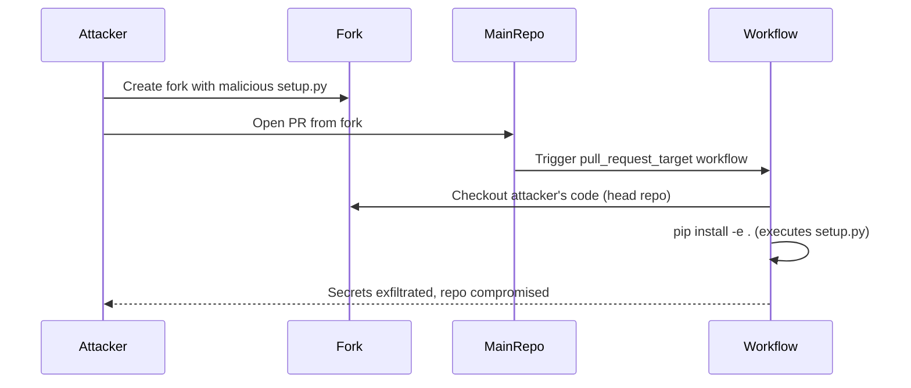

# GHSL-2025-094: Arbitrary Code Execution via Untrusted Checkout in pull_request_target

## Summary

| Item | Value |
|------|-------|
| Advisory ID | GHSL-2025-094 |
| Severity | Critical |
| Affected Component | ag2ai/faststream |
| CVE | N/A |
| CWE | CWE-94 (Improper Control of Generation of Code) |
| Reference | https://securitylab.github.com/advisories/GHSL-2025-094_ag2ai_faststream/ |

## Vulnerability Description

GHSL-2025-094 is an arbitrary code execution vulnerability that occurs when a GitHub Actions workflow:

1. Uses `pull_request_target` trigger (privileged context with write access and secrets)
2. Checks out code from an untrusted PR head repository
3. Executes build/install commands that can run arbitrary code (e.g., `pip install`, `npm install`)

This allows an attacker to execute arbitrary code with the workflow's elevated permissions by:
1. Creating a malicious fork with a backdoored `setup.py` or similar build file
2. Submitting a pull request from that fork
3. The workflow automatically checks out and builds the attacker's code

## Attack Vector



## Vulnerable Code Pattern

```yaml
name: PR Auto Update (Vulnerable)

on:
  pull_request_target:
    branches:
      - main

permissions:
  contents: write
  pull-requests: write

jobs:
  update:
    runs-on: ubuntu-latest
    steps:
      # VULNERABLE: Checkout from untrusted PR head
      - name: Checkout PR code
        uses: actions/checkout@v4
        with:
          token: ${{ secrets.AUTOMERGE_TOKEN }}
          repository: ${{ github.event.pull_request.head.repo.full_name }}
          ref: ${{ github.head_ref }}

      # VULNERABLE: Execute untrusted code via pip install
      - name: Install dependencies
        run: |
          pip install -e .
```

## sisakulint Detection

sisakulint detects this vulnerability pattern with multiple rules:

### 1. untrusted-checkout

```
script/actions/ghsl/ghsl-2025-094.yaml:24:9: untrusted checkout (critical):
'Checkout PR code' checks out potentially untrusted code in a workflow with
privileged triggers [pull_request_target]. Attackers can inject malicious code.
[untrusted-checkout]
```

This rule identifies when:
- A workflow uses privileged triggers (`pull_request_target`, `issue_comment`, `workflow_run`)
- Code is checked out from untrusted sources (PR head, fork repository)

### 2. cache-poisoning-poisonable-step

```
script/actions/ghsl/ghsl-2025-094.yaml:32:9: cache poisoning risk:
'Install dependencies' runs untrusted code after checking out PR head
(triggers: pull_request_target). Attacker can steal cache tokens
[cache-poisoning-poisonable-step]
```

### 3. dangerous-triggers-critical

```
script/actions/ghsl/ghsl-2025-094.yaml:7:3: dangerous trigger (critical):
workflow uses privileged trigger(s) [pull_request_target] without any
security mitigations. [dangerous-triggers-critical]
```

### 4. artipacked

```
script/actions/ghsl/ghsl-2025-094.yaml:24:9: [Medium] actions/checkout without
'persist-credentials: false'. Credentials are stored in .git/config.
[artipacked]
```

## Remediation

### Option 1: Don't checkout untrusted code in privileged context

```yaml
# Use pull_request instead of pull_request_target when possible
on:
  pull_request:
    branches:
      - main
```

### Option 2: Checkout base branch only, then fetch PR changes safely

```yaml
- uses: actions/checkout@v4
  with:
    ref: ${{ github.event.pull_request.base.ref }}

# Only copy specific safe files from PR, not executable code
- name: Fetch PR changes
  run: |
    gh pr diff ${{ github.event.pull_request.number }} > changes.patch
    # Review and apply only safe changes
```

### Option 3: Use workflow_call to isolate privileged operations

```yaml
# Unprivileged workflow runs tests
name: Test PR
on:
  pull_request:

jobs:
  test:
    runs-on: ubuntu-latest
    steps:
      - uses: actions/checkout@v4
      - run: pip install -e . && pytest

# Separate privileged workflow only runs after approval
name: Auto Update
on:
  workflow_run:
    workflows: ["Test PR"]
    types:
      - completed

jobs:
  update:
    if: github.event.workflow_run.conclusion == 'success'
    # ... privileged operations on base branch only
```

### Option 4: Add strict validation before executing code

```yaml
- name: Validate PR source
  run: |
    # Only allow PRs from trusted collaborators
    if [[ "${{ github.event.pull_request.head.repo.full_name }}" != "${{ github.repository }}" ]]; then
      echo "External PRs not allowed for auto-update"
      exit 1
    fi
```

## Test Files

- Vulnerable pattern: `script/actions/ghsl/ghsl-2025-094.yaml`

## References

- [GitHub Security Lab Advisory](https://securitylab.github.com/advisories/GHSL-2025-094_ag2ai_faststream/)
- [Keeping your GitHub Actions and workflows secure Part 1](https://securitylab.github.com/resources/github-actions-preventing-pwn-requests/)
- [OWASP CI/CD Security: Poisoned Pipeline Execution](https://owasp.org/www-project-top-10-ci-cd-security-risks/CICD-SEC-04-Poisoned-Pipeline-Execution)
