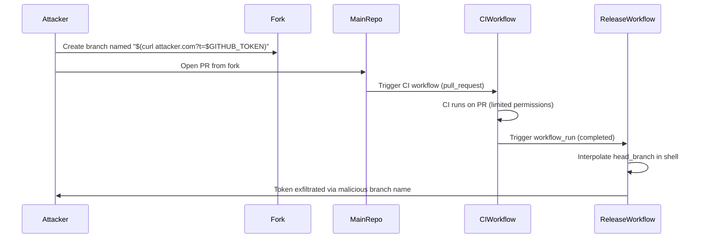

# GHSL-2025-099: Code Injection via workflow_run head_branch

## Summary

| Item | Value |
|------|-------|
| Advisory ID | GHSL-2025-099 |
| Severity | Critical |
| Affected Component | cross-platform-actions/action |
| CVE | N/A |
| CWE | CWE-78 (Improper Neutralization of Special Elements used in an OS Command) |
| Reference | https://securitylab.github.com/advisories/GHSL-2025-099_cross-platform-actions_action/ |

## Vulnerability Description

GHSL-2025-099 is a code injection vulnerability in GitHub Actions workflows that use the `workflow_run` trigger. The vulnerability occurs when untrusted input from `github.event.workflow_run.head_branch` or `github.event.workflow_run.head_repository.full_name` is directly interpolated into shell commands.

The `workflow_run` trigger is particularly dangerous because:
1. It runs with elevated privileges (write access to the repository, access to secrets)
2. It can be triggered by workflows running on pull requests from forks
3. The `head_branch` and `head_repository` values come from the triggering workflow, which can be controlled by attackers

## Attack Vector



## Vulnerable Code Pattern

```yaml
name: Vulnerable Release Workflow

on:
  workflow_run:
    workflows: ["CI"]
    types:
      - completed

permissions:
  contents: write
  packages: write

jobs:
  release:
    runs-on: ubuntu-latest
    steps:
      - uses: actions/checkout@v4

      # VULNERABLE: head_branch is directly interpolated in shell command
      - name: Set tag from branch
        run: |
          tag='${{ github.event.workflow_run.head_branch }}'
          echo "Using tag: $tag"

      # VULNERABLE: Using head_repository.full_name
      - name: Show repo info
        run: |
          echo "Repo: ${{ github.event.workflow_run.head_repository.full_name }}"
```

## sisakulint Detection

sisakulint detects this vulnerability with the `code-injection-critical` rule:

### Detection Output

```
script/actions/ghsl-2025-099.yaml:33:19: code injection (critical):
"github.event.workflow_run.head_branch" is potentially untrusted and used in a
workflow with privileged triggers. Avoid using it directly in inline scripts.
Instead, pass it through an environment variable. [code-injection-critical]

script/actions/ghsl-2025-099.yaml:39:26: code injection (critical):
"github.event.workflow_run.head_repository.full_name" is potentially untrusted
and used in a workflow with privileged triggers. [code-injection-critical]
```

### Untrusted workflow_run Contexts

| Context | Risk | Description |
|---------|------|-------------|
| `github.event.workflow_run.head_branch` | Critical | Branch name from triggering workflow |
| `github.event.workflow_run.head_sha` | Low | SHA is validated by GitHub |
| `github.event.workflow_run.head_repository.full_name` | Critical | Repository name from fork |
| `github.event.workflow_run.head_repository.owner.login` | Critical | Owner from fork |
| `github.event.workflow_run.pull_requests[*].head.ref` | Critical | PR branch references |

## Why workflow_run is Dangerous

The `workflow_run` trigger creates a privilege escalation path:

1. **Initial Trigger**: A `pull_request` workflow runs with read-only permissions
2. **Escalation**: The `workflow_run` trigger fires with full repository permissions
3. **Data Leakage**: Untrusted data from the PR (branch name, repo name) is passed to the privileged context

This design allows attackers to:
- Bypass the security model of `pull_request` triggers
- Execute code with write access and secret access
- Exfiltrate secrets via crafted branch names

## Remediation

### Option 1: Use Environment Variables with Validation

```yaml
- name: Set tag from branch
  env:
    HEAD_BRANCH: ${{ github.event.workflow_run.head_branch }}
  run: |
    # Validate branch name format
    if [[ ! "$HEAD_BRANCH" =~ ^[a-zA-Z0-9/_.-]+$ ]]; then
      echo "::error::Invalid branch name format"
      exit 1
    fi
    tag="$HEAD_BRANCH"
    echo "Using tag: $tag"
```

### Option 2: Only Process Trusted Branches

```yaml
jobs:
  release:
    # Only run for the main repository, not forks
    if: github.event.workflow_run.head_repository.full_name == github.repository
    runs-on: ubuntu-latest
```

### Option 3: Use Commit SHA Instead of Branch Name

```yaml
- name: Checkout specific commit
  uses: actions/checkout@v4
  with:
    # SHA is validated by GitHub and safe to use
    ref: ${{ github.event.workflow_run.head_sha }}
```

### Option 4: Download Artifacts Instead of Using Context

```yaml
- name: Download build info
  uses: actions/download-artifact@v4
  with:
    name: build-info
    github-token: ${{ secrets.GITHUB_TOKEN }}
    run-id: ${{ github.event.workflow_run.id }}
```

## Additional Security Considerations

### Restrict Workflow Permissions

```yaml
permissions:
  contents: read  # Minimize permissions where possible
```

### Add Repository Check

```yaml
jobs:
  release:
    if: |
      github.event.workflow_run.conclusion == 'success' &&
      github.event.workflow_run.head_repository.full_name == github.repository
```

### Use Reusable Workflows with Input Validation

```yaml
# In the triggering workflow
jobs:
  call-release:
    uses: ./.github/workflows/release.yml
    with:
      # Pass validated inputs only
      version: ${{ needs.build.outputs.version }}
```

## Test Files

- Vulnerable pattern: `script/actions/ghsl/ghsl-2025-099.yaml`

## References

- [GitHub Security Lab Advisory](https://securitylab.github.com/advisories/GHSL-2025-099_cross-platform-actions_action/)
- [GitHub Actions: workflow_run event](https://docs.github.com/en/actions/using-workflows/events-that-trigger-workflows#workflow_run)
- [Keeping your GitHub Actions and workflows secure Part 3](https://securitylab.github.com/resources/github-actions-building-blocks/)
- [OWASP CI/CD Security Risks](https://owasp.org/www-project-top-10-ci-cd-security-risks/)
