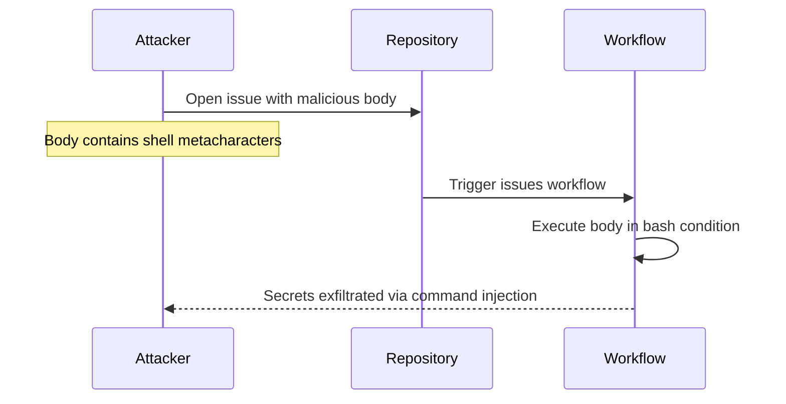

# GHSL-2025-101: Code Injection via Issue Body in issues Trigger

## Summary

| Item | Value |
|------|-------|
| Advisory ID | GHSL-2025-101 |
| Severity | Critical |
| Affected Component | JurajNyiri/HomeAssistant-Tapo-Control |
| CVE | CVE-2025-55192 |
| CWE | CWE-94 (Improper Control of Generation of Code) |
| Reference | https://securitylab.github.com/advisories/GHSL-2025-101_homeassistant-tapo-control/ |

## Vulnerability Description

GHSL-2025-101 is a code injection vulnerability that occurs when a GitHub Actions workflow:

1. Uses `issues` trigger (privileged context with write access and secrets)
2. Directly interpolates `github.event.issue.body` in a bash condition
3. Allows attackers to execute arbitrary commands via crafted issue body

The vulnerability exists in `.github/workflows/issues.yml` at lines 21 and 23, where the issue body is used inside bash `[[ ]]` conditions without proper sanitization.

## Attack Vector



## Vulnerable Code Pattern

```yaml
name: Issues

on:
  issues:
    types:
      - opened

jobs:
  close-issues:
    runs-on: ubuntu-latest
    permissions:
      issues: write
    steps:
      - name: Close issues with invalid cloud password
        # VULNERABLE: github.event.issue.body is user-controlled
        # and directly used in bash condition (CWE-94)
        run: |
          if [[ "${{ github.event.issue.body }}" == *"Invalid cloud password"* ]]; then
            echo "Closing issue with invalid cloud password"
          elif [[ "${{ github.event.issue.body }}" == *"Invalid authentication data"* ]]; then
            echo "Closing issue with invalid authentication data"
          fi
        env:
          GH_TOKEN: ${{ secrets.GITHUB_TOKEN }}
```

## Why `issues` Trigger is Privileged

The `issues` event is considered a privileged trigger because:

1. **Write Access**: The workflow runs with write permissions to the repository
2. **Secrets Access**: The workflow has access to repository secrets
3. **Untrusted Input**: Issue body/title can be controlled by any user who can create issues

This makes it similar to `pull_request_target` and `issue_comment` triggers in terms of security risk.

## sisakulint Detection

sisakulint detects this vulnerability pattern with the `code-injection-critical` rule:

```
script/actions/ghsl/ghsl-2025-101.yaml:27:19: code injection (critical):
"github.event.issue.body" is potentially untrusted and used in a workflow
with privileged triggers. Avoid using it directly in inline scripts.
Instead, pass it through an environment variable.
[code-injection-critical]
```

This rule identifies when:
- A workflow uses privileged triggers (`issues`, `issue_comment`, `pull_request_target`, `workflow_run`)
- Untrusted input (issue body, issue title, etc.) is directly interpolated in `run:` scripts

## Remediation

### Option 1: Pass untrusted input via environment variable

```yaml
- name: Close issues with invalid cloud password
  env:
    ISSUE_BODY: ${{ github.event.issue.body }}
    GH_TOKEN: ${{ secrets.GITHUB_TOKEN }}
  run: |
    if [[ "$ISSUE_BODY" == *"Invalid cloud password"* ]]; then
      echo "Closing issue with invalid cloud password"
    elif [[ "$ISSUE_BODY" == *"Invalid authentication data"* ]]; then
      echo "Closing issue with invalid authentication data"
    fi
```

### Option 2: Use GitHub Script action for safer handling

```yaml
- name: Close issues with invalid cloud password
  uses: actions/github-script@v7
  with:
    script: |
      const body = context.payload.issue.body || '';
      if (body.includes('Invalid cloud password')) {
        await github.rest.issues.update({
          owner: context.repo.owner,
          repo: context.repo.repo,
          issue_number: context.issue.number,
          state: 'closed'
        });
      }
```

### Option 3: Use contains() function in workflow condition

```yaml
- name: Close issues with invalid cloud password
  if: contains(github.event.issue.body, 'Invalid cloud password')
  run: |
    echo "Closing issue with invalid cloud password"
    gh issue close ${{ github.event.issue.number }}
  env:
    GH_TOKEN: ${{ secrets.GITHUB_TOKEN }}
```

## Auto-fix

sisakulint can automatically fix this vulnerability using the `-fix` flag:

```bash
sisakulint -fix on script/actions/ghsl/ghsl-2025-101.yaml
```

The auto-fix moves the untrusted expression to an environment variable:

```yaml
# Before (vulnerable)
- run: |
    if [[ "${{ github.event.issue.body }}" == *"Invalid cloud password"* ]]; then

# After (fixed)
- env:
    ISSUE_BODY: ${{ github.event.issue.body }}
  run: |
    if [[ "$ISSUE_BODY" == *"Invalid cloud password"* ]]; then
```

## Test Files

- Vulnerable pattern: `script/actions/ghsl/ghsl-2025-101.yaml`

## References

- [GitHub Security Lab Advisory](https://securitylab.github.com/advisories/GHSL-2025-101_homeassistant-tapo-control/)
- [Vendor Advisory](https://github.com/JurajNyiri/HomeAssistant-Tapo-Control/security/advisories/GHSA-xccg-43hx-c846)
- [Keeping your GitHub Actions and workflows secure Part 1](https://securitylab.github.com/resources/github-actions-preventing-pwn-requests/)
- [OWASP CI/CD Security: Poisoned Pipeline Execution](https://owasp.org/www-project-top-10-ci-cd-security-risks/CICD-SEC-04-Poisoned-Pipeline-Execution)
