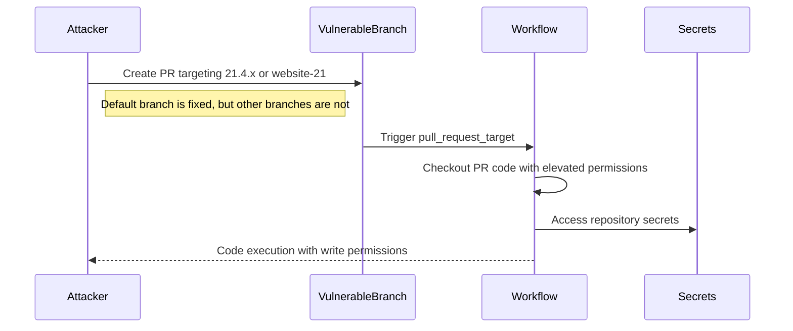

# GHSL-2025-111: Privilege Escalation via pull_request_target

## Summary

| Item | Value |
|------|-------|
| Advisory ID | GHSL-2025-111 |
| Severity | High |
| Affected Component | nrwl/nx |
| CVE | N/A |
| CWE | CWE-269 (Improper Privilege Management) |
| Reference | https://securitylab.github.com/advisories/GHSL-2025-111_nrwl_nx/ |

## Vulnerability Description

GHSL-2025-111 is a privilege escalation vulnerability in the `pr-title-validation.yml` workflow. The vulnerability exists because:

1. The default branch was fixed, but vulnerable workflow remained on other branches (`21.4.x`, `website-21`)
2. The workflow uses `pull_request_target` without branch filters
3. An attacker can target the vulnerable branches to execute code with elevated privileges

## Attack Vector



## Vulnerable Code Pattern

```yaml
name: PR Title Validation (Vulnerable)

on:
  pull_request_target:
    types: [opened, edited, synchronize]
    # VULNERABLE: No branch filter - all branches affected
    # Fixed on main but vulnerable on 21.4.x and website-21 branches

permissions:
  contents: write
  pull-requests: write

jobs:
  validate-title:
    runs-on: ubuntu-latest
    steps:
      - uses: actions/checkout@v4

      # VULNERABLE: PR title directly interpolated
      - name: Validate PR title
        run: |
          echo "Validating PR: ${{ github.event.pull_request.title }}"

      # VULNERABLE: PR branch checkout in pull_request_target
      - uses: actions/checkout@v4
        with:
          ref: ${{ github.event.pull_request.head.sha }}

      - name: Run validation script
        run: |
          node scripts/validate-pr-title.js
```

## sisakulint Detection

sisakulint detects this vulnerability with multiple rules:

### 1. untrusted-checkout

```
[untrusted-checkout] checking out untrusted code from pull request in workflow
with privileged trigger 'pull_request_target'. This allows potentially malicious
code from external contributors to execute with access to repository secrets.
```

### 2. code-injection-critical

```
[code-injection-critical] "github.event.pull_request.title" is potentially
untrusted and used in a workflow with privileged triggers.
```

## Branch-Specific Vulnerability

This case demonstrates an important security lesson:

| Branch | Status |
|--------|--------|
| main/master | Fixed |
| 21.4.x | Vulnerable |
| website-21 | Vulnerable |

**Lesson**: Security fixes must be applied to ALL branches, not just the default branch.

## Remediation

### Option 1: Add Branch Filter

```yaml
on:
  pull_request_target:
    types: [opened, edited, synchronize]
    branches:
      - main
      - master
```

### Option 2: Use pull_request Instead

```yaml
on:
  pull_request:
    types: [opened, edited, synchronize]
# Note: pull_request trigger doesn't have secrets access from forks
```

### Option 3: Remove Vulnerable Workflow from All Branches

```bash
# Delete workflow from all branches
git checkout 21.4.x
git rm .github/workflows/pr-title-validation.yml
git commit -m "fix: remove vulnerable workflow"
git push

git checkout website-21
git rm .github/workflows/pr-title-validation.yml
git commit -m "fix: remove vulnerable workflow"
git push
```

### Option 4: Use Environment Variables

```yaml
- name: Validate PR title
  env:
    PR_TITLE: ${{ github.event.pull_request.title }}
  run: |
    echo "Validating PR: $PR_TITLE"
```

## Fix Commits

- https://github.com/nrwl/nx/commit/8f8aa5e6af85f5232ce182998a5e32ac1dcc9dc0
- https://github.com/nrwl/nx/commit/1558e97918f3a065e0dbc227f2f3213c3b75d132

## Impact Mitigation

The potential impact was limited because:
- NPM publishing requires 2FA (prevents package compromise)
- The attacker would still have repository write access

## Auto-Fix Support

sisakulint provides auto-fix for this vulnerability:

```bash
sisakulint -fix on script/actions/ghsl/ghsl-2025-111.yaml
```

## Test Files

- Vulnerable pattern: `script/actions/ghsl/ghsl-2025-111.yaml`

## References

- [GitHub Security Lab Advisory](https://securitylab.github.com/advisories/GHSL-2025-111_nrwl_nx/)
- [Previous Fix PR](https://github.com/nrwl/nx/pull/32545)
- [GitHub Actions: pull_request_target](https://docs.github.com/en/actions/using-workflows/events-that-trigger-workflows#pull_request_target)
